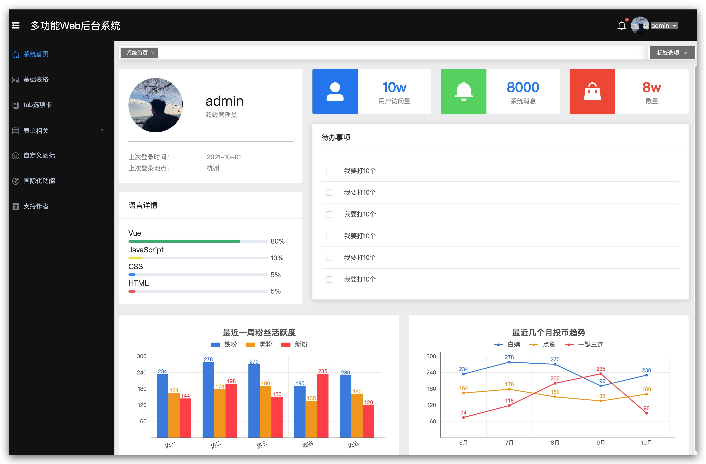

# system-manage-template

<a href="https://github.com/vuejs/vue">
    
  </a>
  <a href="https://github.com/ElemeFE/element">
    
  </a>
  <a href="https://github.com/ink-song/system-manage-template/blob/master/LICENSE">
    
  </a>
  <a href="https://github.com/ink-song/system-manage-template/releases">
    
  </a>


<!-- [English document](https://github.com/ink-song/manage-system/blob/master/README_EN.md) -->

## 项目截图

### 登录


### 首页



## 赞赏

请作者喝杯咖啡吧！(微信公众号)


## 前言

该方案作为一套多功能的后台框架模板，适用于绝大部分的后台管理系统（Web Management System）开发。基于 Vue3，使用 vue-cli3 脚手架，引用 Element Plus 组件库，方便开发快速简洁好看的组件。分离颜色样式，支持手动切换主题色，而且很方便使用自定义主题色。

<!-- ## 功能

-   [x] Element Plus
-   [x] 登录/注销
-   [x] Dashboard
-   [x] 表格
-   [x] Tab 选项卡
-   [x] 表单
-   [x] 图表 :bar_chart:
-   [ ] 富文本编辑器
-   [ ] markdown 编辑器
-   [x] 图片拖拽/裁剪上传
-   [ ] 支持切换主题色 :sparkles:
-   [ ] 列表拖拽排序
-   [x] 权限测试
-   [x] 404 / 403
-   [x] 三级菜单
-   [x] 自定义图标
-   [ ] 可拖拽弹窗
-   [x] 国际化 -->

## 安装步骤

#### 下载项目
```
git clone https://github.com/king-song823/system-manage-template.git      把模板下载到本地
```

#### 安装依赖
```
cd system-manage-template    进入模板目录
yarn         安装项目依赖，等待安装完成之后，安装失败可用 cnpm 或 npm
```

#### 访问和部署

```
yarn serve  开启服务器，浏览器访问 http://localhost:8080

yarn build 执行构建命令，生成的dist文件夹放在服务器下即可访问
```

